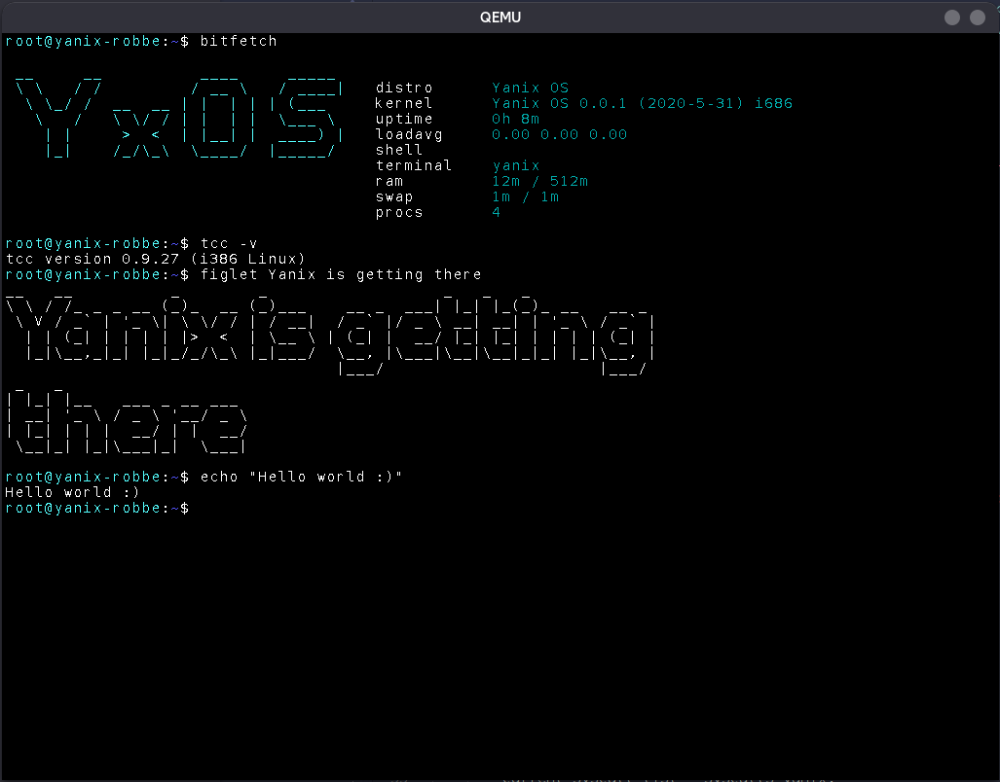

# yanix
Just a UNIX-like kernel build on caffeine and 
sleep deprivation. I call it yanix (**Y**et **A**nother u**NIX** clone) The goal is to make it as **POSIX**
compliant as possible and self sustaining.

Now able to run **doom**!

This project is a hobby os so this is not perfect,
I am currently trying to make the codebase as clean as possible
so others can learn from this os and build their own.
However some parts, especially the older parts of the os,
are not the prettiest / most well documented code ever.

You are welcome to make any pull requests and help build this os
further.

If you are starting out I really recommend the osdev.org wiki 
as a lot of the code here is build on the information found
on that wiki. For more helpfull links check the bottom of this page

## Currently supported features:
### CPU-based Features:
#### Supported Architectures:
- [x] x86
- [ ] x86-64
- [ ] arm

- [x] Multitasking
- [ ] Multiprocessing
- [x] User mode

### Kernel Features:
- [x] Monolithic kernel
- [x] Preemptible kernel
- [x] Virtual filesystem
- [x] Elf exec driver
- [x] Memory management
- [x] Ramdisk support
- [ ] Moduling system

### Supported Filesystems:
- [x] ext2
- [ ] fat32
- [ ] ext3
- [ ] ext4

### Supported Devices & Drivers:
- [x] i8042         (PS/2 Controller)
- [x] Ramdisk       (memory mapped storage device)
- [x] ps2 mouse 
- [x] ps2 keyboard
- [x] CMOS driver
- [x] PCI driver
- [x] ata
- [ ] networking

### Supported Video Interfaces:
- [x] VESA 3.0 graphics
- [x] Standard vga terminal buffer

### System Features:
- [x] Home made bootloader
 
## Features/stuff coming in next updates:
- Time system
- Networking
- Code cleaning because it is a mess at some places
- Documenting the important stuff 
- Redo the ext2 driver because it is very messy and incomplete

## Ported software
Right now we are working hard on porting other unix software to this operating system.
The first port ever completed is FIGlet and it runs perfectly on yanix!

	__   __          _        _                                                   
	\ \ / /_ _ _ __ (_)_  __ (_)___    __ ___      _____  ___  ___  _ __ ___   ___ 
	 \ V / _` | '_ \| \ \/ / | / __|  / _` \ \ /\ / / _ \/ __|/ _ \| '_ ` _ \ / _ \
	  | | (_| | | | | |>  <  | \__ \ | (_| |\ V  V /  __/\__ \ (_) | | | | | |  __/
	  |_|\__,_|_| |_|_/_/\_\ |_|___/  \__,_| \_/\_/ \___||___/\___/|_| |_| |_|\___|

- [x] FIGlet
- [x] Bash
- [x] TCC
- [x] nasm
- [x] smlrcc
- [x] doom (well, kind of. Who needs input or sound anyways)
- [x] bitfetch
- [ ] lua
- [ ] GCC
- [ ] Python

## Getting it to work on your machine:

In order to build and run yanix you will need the following items:
- NASM assembler
- the yanix toolchain
- maindisk.iso

The last two can be found [here](https://drive.google.com/drive/folders/1ChTpxsZRl50aM4hI0YoOpPqn3rwtLK2A?usp=sharing).
Just put both files in the main yanix/ directory.

### Building
First mount maindisk.iso like so:

	sudo make mount_disk

Then to build yanix run 

	make clean && make run

### Running
To start yanix in qemu run `make run` in terminal and it should start running in qemu.

## Links

A big thanks to anyone that helped on one of the articles found bellow
without those people this project would not have been possible.

#### osdev wiki and forum:
- https://wiki.osdev.org  && https://forum.osdev.org

#### The James Molloy kernel development tutorials:

A few notes about these tutorials:
I personally would not recommend these articles if you just are starting out 
as these generally do not explain the material very deeply and you are at risk
of just copying code that works and not really understanding what happens under 
the hood. The tutorials also have some bugs in them check (this page)[https://wiki.osdev.org/James_Molloy%27s_Tutorial_Known_Bugs]
this page for more information

- http://www.jamesmolloy.co.uk/tutorial_html/

#### Writing a Simple Operating System from scratch - Nick Blundell

This is a pdf that explains all the beginnings of an os and it's
bootloader, the document explains the material very good.

- http://www.cs.bham.ac.uk/~exr/lectures/opsys/10_11/lectures/os-dev.pdf

#### os-tutorial - cfenollosa

This page is also very good if you are just starting out although it is mostly
based on the document by Nick Blundell that explains everything, so you might as
well use that. 

- https://github.com/cfenollosa/os-tutorial

#### The Internet

If you still struggle to understand something our want to implement something that
is not listed in any of these documents you can still search the web. Sadly enough
a lot of os development sites and articles are now down because of various reasons
but there is still a lot just lying around waiting for you to find it.
